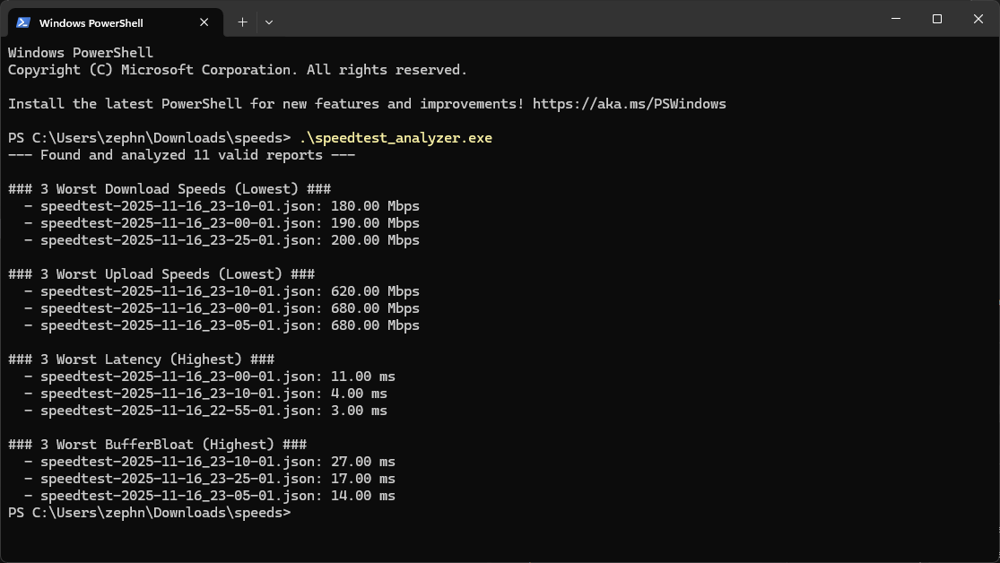

# Speedtest Analyzer



A simple Rust utility that scans a directory of `fast-cli` JSON reports, analyzes them, and finds the top 3 worst-performing time slots for download, upload, latency, and bufferbloat.

This tool is perfect for logging your internet speed every 5 minutes and then quickly finding the data points that prove you're having issues, all without having to manually inspect hundreds of files.

-----

## Getting Started

This project is broken into two parts:

1.  **Collecting the Data:** Using `fast-cli` and `cron` to generate the JSON reports.
2.  **Analyzing the Data:** Using this Rust program to parse those reports.

### Step 1: Collect the Data (The Cron Job)

This analyzer is designed to read the JSON output from **[sindresorhus/fast-cli](https://www.google.com/search?q=httpss://github.com/sindresorhus/fast-cli)**.

#### Finding Your Paths

Before you edit your crontab, you need to find the **full, absolute paths** for two commands. Cron runs in a minimal environment and doesn't know your normal shell's `PATH`.

1.  **Find the `fast` path:** Run this in your terminal:

    ```bash
    which fast
    ```

    *Example Output:* `/home/zephrnos/.nvm/versions/node/v20.19.5/bin/fast`
    (This is the path you'll use in the main command)

2.  **Find the `node` path:** `fast-cli` is a Node.js script, so cron also needs to find `node`.

    ```bash
    which node
    ```

    *Example Output:* `/home/zephrnos/.nvm/versions/node/v20.19.5/bin/node`
    (You'll use the *directory* part for the `PATH` variable: `/home/zephrnos/.nvm/versions/node/v20.19.5/bin`)

#### Setting Up the Cron Job

1.  Open your crontab editor:

    ```bash
    crontab -e
    ```

2.  Add the following two lines. **Use the paths you just found above.** The `PATH` line is **essential** for cron to find the `node` executable.

    ```bash
    # Set the environment PATH using the directory from `which node`
    PATH=/home/zephrnos/.nvm/versions/node/v20.19.5/bin:/usr/bin:/bin

    # Every 5 minutes, run fast-cli (using the path from `which fast`)
    # and save a new timestamped JSON in the Speedtests directory
    */5 * * * * /home/zephrnos/.nvm/versions/node/v20.19.5/bin/fast --upload --json > /home/zephrnos/Speedtests/speedtest-$(date +\%Y-\%m-\%d_\%H-\%M-\%S).json 2>> /home/zephrnos/Speedtests/cron_errors.log
    ```

3.  Let this run for a day or two to collect a good amount of data.

-----

### Step 2: Build and Run the Analyzer

#### Installation

1.  Navigate to this project's root directory (where `Cargo.toml` is).
2.  Build the optimized executable:
    ```bash
    cargo build --release
    ```
    This will create the program at `target/release/speedtest_analyzer`.

#### Usage

1.  `cd` into the directory where all your JSON files are stored.

    ```bash
    cd /home/zephrnos/Speedtests
    ```

2.  Run the analyzer by calling its full path.

    ```bash
    # Make sure to change /path/to/ your project's actual location
    /home/zephrnos/projects/speedtest_analyzer/target/release/speedtest_analyzer
    ```

    (You could also copy the executable from `target/release` into your `Speedtests` folder and just run `./speedtest_analyzer`).

-----

## Example Output

The program will scan all `.json` files in that folder and print a report.

```
!> Skipping empty file: speedtest-2025-11-16_22-45-01.json
--- Found and analyzed 35 valid reports ---

### 3 Worst Download Speeds (Lowest) ###
  - speedtest-2025-11-16_10-35-01.json: 45.12 Mbps
  - speedtest-2025-11-16_10-50-01.json: 52.30 Mbps
  - speedtest-2025-11-16_14-15-01.json: 61.05 Mbps

### 3 Worst Upload Speeds (Lowest) ###
  - speedtest-2025-11-16_10-35-01.json: 21.40 Mbps
  - speedtest-2025-11-16_10-50-01.json: 22.15 Mbps
  - speedtest-2025-11-16_09-05-01.json: 23.00 Mbps

### 3 Worst Latency (Highest) ###
  - speedtest-2025-11-16_10-35-01.json: 110.45 ms
  - speedtest-2025-11-16_08-20-01.json: 95.80 ms
  - speedtest-2025-11-16_10-50-01.json: 92.10 ms

### 3 Worst BufferBloat (Highest) ###
  - speedtest-2025-11-16_10-35-01.json: 98.12 ms
  - speedtest-2025-11-16_08-20-01.json: 81.77 ms
  - speedtest-2025-11-16_10-50-01.json: 79.22 ms
```

-----
